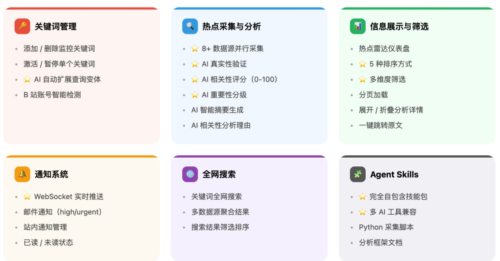

# AI 热点监控工具

## 一、项目介绍

这是一个以 **AI 编程实战** 为核心的项目，基于 Express 5 + React 19 + OpenRouter + Socket.io，用 AI 编程的方式从 0 到 1 开发一个《AI 热点监控工具》


输入要监控的关键词，系统自动从 Twitter、Bing、HackerNews、搜狗、B 站等 **8+** 个信息源聚合抓取内容，利用 AI 进行真假识别和相关性分析，并通过 WebSocket 实时推送和邮件通知用户。此外，还将热点监控能力封装为 **Agent Skills 技能包**，让 Cursor、VSCode Copilot、Claude Code 等 AI 编程工具也能直接使用。


### 为什么做这个项目？

我平常喜欢上网冲浪，喜欢前沿消息，要利用工具第一时间自动发现最新的热点（比如 AI 大模型的更新），并且及时给我发送通知，让我能够走在吃瓜第一线。

既然如此，**不如做一个更通用的工具**。

这就是 AI 热点监控工具的起点：让 AI 帮你盯热点，第一时间获取优质信息！

### 6 大核心能力

1）配置监控关键词，支持激活 / 暂停。


2）AI 自动从 8+ 数据源抓取和分析热点，利用 AI 进行查询扩展、真假识别、相关性分析和智能摘要。


3）多维度筛选和排序，按来源、重要性、时间范围筛选，按热度、相关性、时间排序。


4）全网搜索，输入关键词从多个数据源聚合搜索。


5）实时通知，WebSocket 实时推送 + 邮件通知。


6）Agent Skills 技能包，安装后在 Cursor、VSCode Copilot、Claude Code 中都能直接使用。

## 二、更多介绍

功能模块：



架构设计：


## 三、快速运行

### 前置条件

- Node.js ≥ 18（推荐 20 LTS）
- 一个 [OpenRouter API Key](https://openrouter.ai/settings/keys)（必需，用于 AI 分析）

### 1. 克隆并安装依赖

```bash
git clone https://github.com/liyupi/yupi-hot-monitor.git
cd yupi-hot-monitor

# 后端
cd server
npm install
npx prisma generate
npx prisma db push

# 前端
cd ../client
npm install
```

### 2. 配置环境变量

```bash
cp server/.env.example server/.env
```

编辑 `server/.env`，至少填入 OpenRouter API Key：

```bash
OPENROUTER_API_KEY=sk-or-v1-你的key
# Twitter API Key（可选）
TWITTER_API_KEY=你的key
```

### 3. 启动服务（两个终端）

```bash
# 终端 1：启动后端（端口 3001）
cd server && npm run dev

# 终端 2：启动前端（端口 5173）
cd client && npm run dev
```

访问 **http://localhost:5173** ，输入关键词即可开始监控热点 

| 服务 | 地址 |
|------|------|
| 前端页面 | http://localhost:5173 |
| 后端 API | http://localhost:3001 |
| 数据库管理 | `cd server && npx prisma studio`（可选） |
